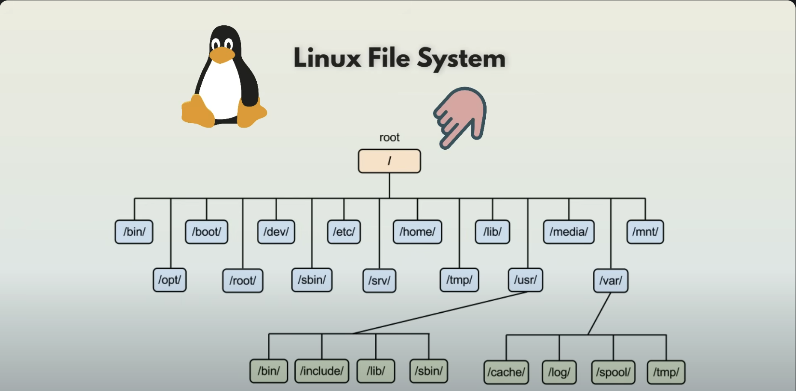

# Linux File system

# Linux-Commands

## 1. uname (short name for UnixName)
Prints basic info about the Operating System name and system hardware. By default, prints the operating system.

### Common Options:

OPTION                          DESCRIPTION
-a                              Displays all system information
-s                              Shows the kernel name
-r                              Displays the kernel release name
-v                              Shows the kernel version
-m                              Prints the machine hardware architecture (e.g., x86_64)
-n                              Displays the network hostname
-o                              Prints the operating system name
-p                              Shows the processor type

## 2. pwd (Print Working Directory)
Shows the current directory.

## 3. ls -l (Long listing Format)
Shows file details like permissions, owner, size and modification date

## 4. | (Pipe command is used to pass the output of one command as input to another)
It allows us to chain multiple commands together.

## 5. grep (Global Regular Expression Print)
Used to search for text patterns in files or output. It filters and displays lines that match a specific string or pattern.
Example: ls -l | grep root

## 6. > (Redirection)
Redirect the output of a command to a file
Example: ls -l | grep root > output.txt

## 7. cp (Copy)
Command to create copies of files and directories across a filesystem.
Source: The file or directory we want to copy
Destination: The target location where the copy will placed

Example: cp playground.config /users/abhinav/documents

## 8. wc (Word Count)
Word count command used to count the number of lines, words, characters in a file or standard input.
### Common Options:

OPTION                             DESCRIPTION
-l                                 Count lines
-w                                 Count words
-c                                 Count bytes
-m                                 Count characters
-L                                 Find the longest line length

## 9. find [starting_path] [option] [expression]
Used to search for files and directories in a directory hierarchy.
starting_path: The directory to start the search from.
option: We can search by name, file type, file size or permission.

Example: find / -name "*.conf"
where '/' - shows the whole file system

## 9. diff file1 file2
Used to compare two files and show the differences between them.

Example: diff [filename1] [filename2]

## 10. curl (Client URL)
Used to transfer data from or to a server using various protocols like HTTP, FTP. Commonly used for interacting with APIs and debugging networking requests.
### Command Options

OPTION                              DESCRIPTION
-I                                  Fetches only the headers of a web page

## 11. chmod
Change mode command modifies file permissions. Each permission has a numeric value:

    r(read) = 4     w(write) = 2       x(execute) = 1

### Common Permission Settings
Command                             Meaning
chmod 000 [filename]                '000' means no permissions at all
chmod 444 [filename]                '444' means only read permission
chmod 777 [filename]                '777' means full permissions (read, write, execute for all)
chmod 755 [filename]                '755' means Owner: rwx, Group & Other: rx (good for scripts)
chmod 644 [filename]                '644' means Owner: rw, Group & Other: r (default for text files)
chmod 600 [filename]                '600' means only owner can read & write (good for sensitive files)